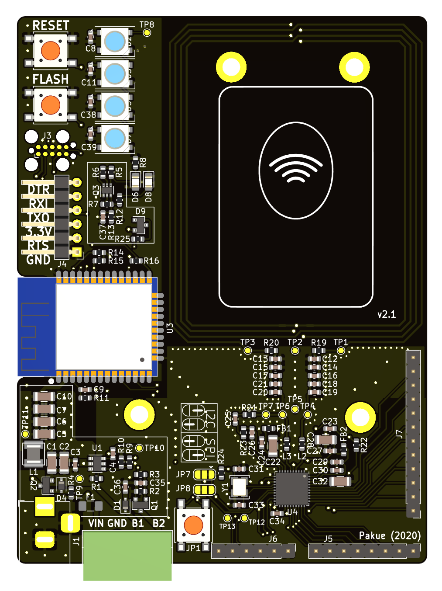

HoDoor is an access control board that uses RFID (13.56MHz) to authenticate users e.g. to enter restricted areas. The firmware repository can be found [here]() (to be released).

## ToDo
* generate new images of version 2.1
* generate Gerber files
* generate new 3d STEP files

The work is release as is without any warranties or guarantees. Use on your own risk.

## License

Designed by Patrick Kübler (except for Adafruit PN532 Shield part). Creative Commons Attribution/Share-Alike.

### Adafruit PN532 RFID/NFC Shield for Arduino

The NFC part of the board is based upon the Adafruit PN532 RFID/NFC Shield for Arduino. The design files can be found in the according [repository](https://github.com/adafruit/Adafruit-PN532-RFID-NFC-Shield) and the board can be purchased from [Adafruit](https://www.adafruit.com/product/789).

Following changes were made from the Adafruit design:
* Moved pinheader around (no Arduino Shield compatebility anymore)
* Moved some components and routing
* removed LED power indicator
* no prototyping area
* removed 3.3V regulator (handled by the HoDoor board)

**README from Adafruit PN532 Shield**

>We've taken our popular Adafruit PN532 breakout board and turned it into a shield - the perfect tool for any 13.56MHz RFID or NFC application. The Adafruit NFC shield uses the PN532 chip-set (the most popular NFC chip on the market) and is what is embedded in pretty much every phone or device that does NFC. It can pretty much do it all, such as read and write to tags and cards, communicate with phones (say for payment processing), and 'act' like a NFC tag. If you want to do any sort of embedded NFC work, this is the chip you'll want to use!

>These are the Eagle CAD files for the Adafruit PN532 RFID/NFC Shield for Arduino:

>* http://www.adafruit.com/products/789

>License

>Adafruit invests time and resources providing this open source design, please support Adafruit and open-source hardware by purchasing products from Adafruit!

>All text above must be included in any redistribution

>Designed by Limor Fried/Ladyada and Kevin Townsend for Adafruit Industries. Creative Commons Attribution/Share-Alike, all text above must be included in any redistribution. See license.txt for additional information.

